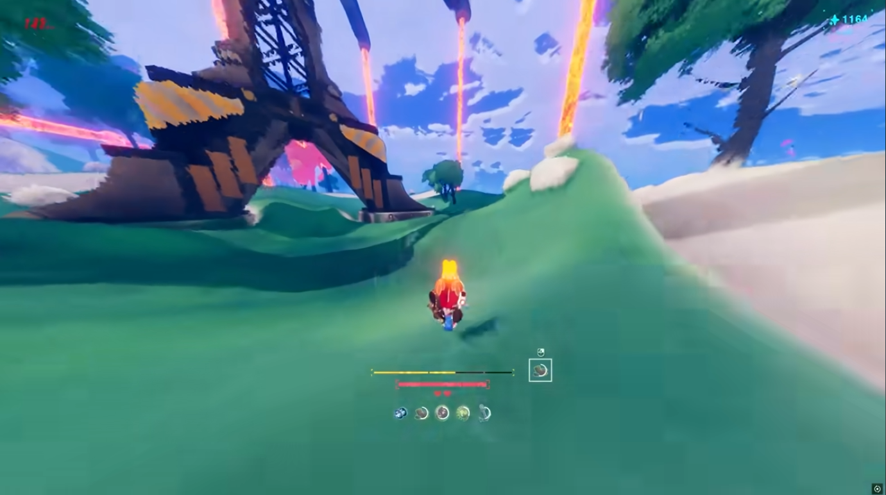
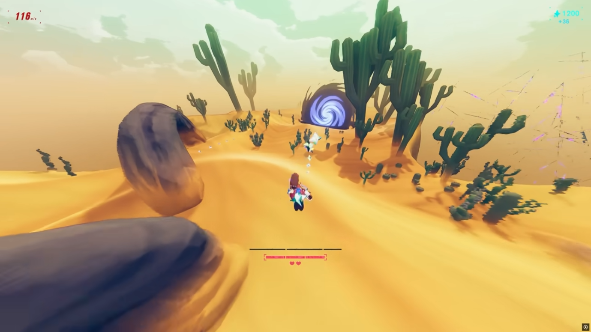
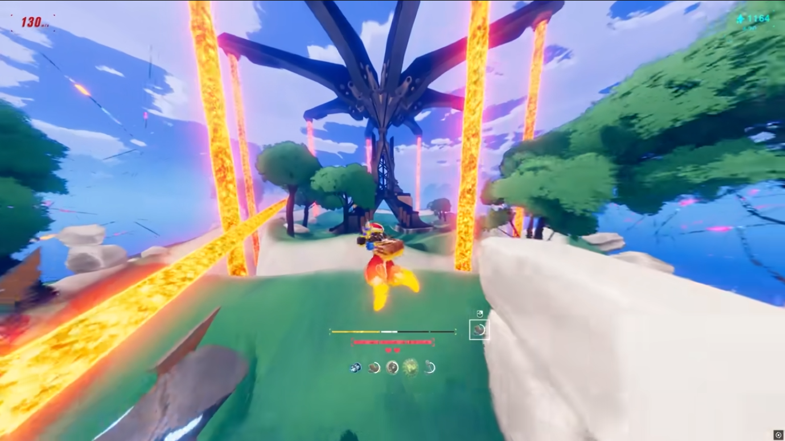

# Especificação da Implementação

> [!CAUTION]
> - Você <ins>**não pode utilizar ferramentas de IA para escrever esta
>   especificação**</ins>

> [!WARNING]
> - Após a entrega da primeira versão completa, esta especificação não
>   poderá ser alterada. A implementação final deverá corresponder ao que
>   estiver descrito neste arquivo.

## Integrantes da dupla

- **Aluno 1 - Nome**: <mark>`Alexandre Ikeda Mucenic`</mark>
- **Aluno 1 - Cartão UFRGS**: <mark>`587903`</mark>

- **Aluno 2 - Nome**: <mark>`Rafael Borges Stephanou`</mark>
- **Aluno 2 - Cartão UFRGS**: <mark>`590367`</mark>

## Detalhes do que será implementado

- **Título do trabalho**: <mark>`Hasty Wings`</mark>
- **Parágrafo curto descrevendo o que será implementado**: <mark>
`Jogo 3D de corrida baseado no momentum de um pássaro, inspirado em Haste e Tiny Wings. O
personagem desliza automaticamente sobre um terreno com inclinações que o
lançam ao ar, dependendo da inclinação delas. O jogador controla a direção e um "dive" para pousar alinhado
com as rampas e manter velocidade, coletando itens ao longo da pista sem
cair do mapa. O jogador deve manter uma certa velocidade (ou viajar uma certa distância por períodos de tempo) para evitar que
o sol se ponha no horizonte, senão o jogo acaba.`</mark>

## Especificação visual

### Vídeo - Link

> [!IMPORTANT]
> - Coloque aqui um link para um vídeo que mostre a aplicação gráfica
>   de referência que você vai implementar. **Sua implementação deverá
>   ser o mais parecido possível com o que é mostrado no vídeo (mais
>   detalhes abaixo).**
> - **Você não pode escolher como referência: (1) algum trabalho realizado
>   por outros alunos desta disciplina, em semestres anteriores. (2) Minecraft.**
> - Por exemplo, você pode colocar um vídeo de um jogo que você gosta,
>   e seu trabalho final será uma re-implementação do jogo.
> - O vídeo pode ser um link para YouTube, Google Drive, ou arquivo mp4 dentro
>   do próprio repositório. Mas, garanta que qualquer um tenha
>   permissão de acesso ao vídeo através deste link.

<mark>`https://www.youtube.com/watch?v=dHoXrWIawxY`</mark>

### Vídeo - Timestamp

> [!IMPORTANT]
> - Coloque aqui um **intervalo de ~30 segundos** do vídeo acima, que
>   será a base de comparação para avaliar se o seu trabalho final
>   conseguiu ou não reproduzir a referência.

- **Timestamp inicial**: <mark>`0:12`</mark>
- **Timestamp final**: <mark>`0:20`</mark>

### Imagens

> [!IMPORTANT]
> - Coloque aqui **três imagens** capturadas do vídeo acima, que você
>   irá usar como ilustração para as explicações que vêm abaixo.
> - As imagens devem estar armazenadas neste repositório, no diretório
>   `images/spec/`, com os nomes `image1`, `image2` e `image3`.
> - Cada imagem deve usar o formato `.jpg` ou `.png`. Ajuste a extensão
>   nos vínculos abaixo para que corresponda ao arquivo armazenado.
> - Escolha imagens que correspondam a momentos do intervalo indicado
>   acima ou que sejam relevantes para a comparação com a implementação.

#### Imagem 1

- **Descrição**: <mark>`Personagem "mergulhando" na descida do terreno para ganhar velocidade`</mark>

#### Imagem 2

- **Descrição**: <mark>`Personagem coletando objetos coletáveis ao colidir com eles`</mark>

#### Imagem 3

- **Descrição**: <mark>`Personagem "voando" após saltar com alta velocidade usando a subida no terreno`</mark>

## Especificação textual

Para cada um dos requisitos abaixo (detalhados no [Enunciado do Trabalho final - Moodle](https://moodle.ufrgs.br/mod/assign/view.php?id=6302370)), escreva um parágrafo **curto** explicando como este requisito será atendido, apontando itens específicos do vídeo/imagens que você incluiu acima que atendem estes requisitos.

### Malhas poligonais complexas
<mark>`Personagem (modelo OBJ importado) e terreno (grid de vértices com alturas variáveis, formando as ondulações da pista), ambos malhas de triângulos.`</mark>

### Transformações geométricas controladas pelo usuário
<mark>`O personagem corre para frente automaticamente; o jogador controla sua direção (rotação horizontal aplicada à Model matrix do personagem) e pode acionar o dive, que inclina o modelo para baixo. Ambas são transformações geométricas do personagem, controladas pelo mouse.`</mark>

### Diferentes tipos de câmeras
<mark>`Câmera em terceira pessoa que segue o personagem por trás, orientação vertical fixa e orientação horizontal controlada pelo mouse (principal), e câmera livre com eixos totalmente controláveis pelo jogador (secundária).`</mark>

### Instâncias de objetos
<mark>`Coletáveis desenhados com Model matrices ao longo do terreno.`</mark>

### Testes de intersecção
<mark>`Personagem com o terreno para detectar quedas; Personagem com coletáveis para marcar pontos`</mark>

### Modelos de Iluminação em todos os objetos
<mark>`Iluminação phong por pixel com luz direcional simulando um sol, aplicada ao personagem, terreno e coletáveis.`</mark>

### Mapeamento de texturas em todos os objetos
<mark>`Texturas de imagem em todos os objetos
(terreno, personagem, coletáveis), sem esticamento não-natural.` </mark>

### Movimentação com curva Bézier cúbica
<mark>`Um coletável especial se movimenta ao longo de uma curva de Bézier cúbica, flutuando em caminho curvo.`</mark>

### Animações baseadas no tempo ($\Delta t$)
<mark>`Movimento pra frente do personagem, rotação do personagem, dive, que inclina o personagem pra baixo vão ser computadas considerando o tempo entre os frames, mantendo a velocidade constante independentemente do hardware.`</mark>

### Funcionalidade extra obrigatória

> [!IMPORTANT]
> - Descreva a funcionalidade extra relacionada à Computação Gráfica
>   que será implementada.
> - Esta funcionalidade também deverá ser documentada no arquivo
>   `README.md` da entrega final.

<mark>`Sombra dos objetos causada pela iluminação do "sol"(direção da luz)`</mark>

## Limitações esperadas

> [!IMPORTANT]
> - Coloque aqui uma lista de detalhes visuais ou de interação que
>   aparecem no vídeo e/ou imagens acima, mas que você **não pretende
>   implementar** ou que você **irá implementar parcialmente**.
> - Para cada item, **explique por que** não será implementado ou por
>   que será implementado parcialmente.

<mark>`Só serão implementadas as funcionalidades de movimento do personagem do jogo 'Haste', excluindo as características "roguelike" do jogo. Os gráficos também serão bastante simplificados e os objetos não necessariamente serão similares aos jogos originais. O objetivo do jogo será muito mais parecido com o jogo 'Tiny Wings', mas no formato 3D, já que o jogo original é 2D.`</mark>
